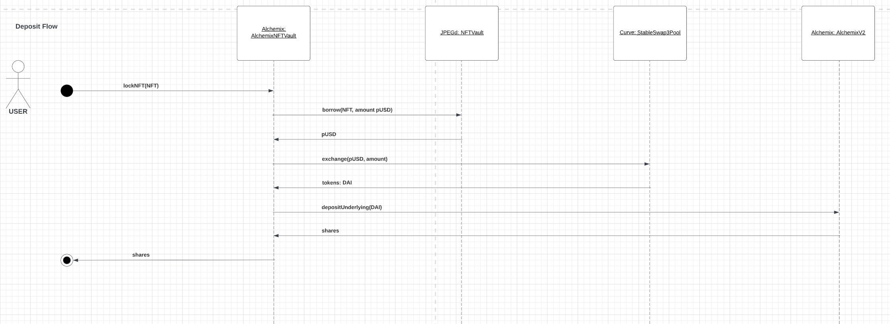
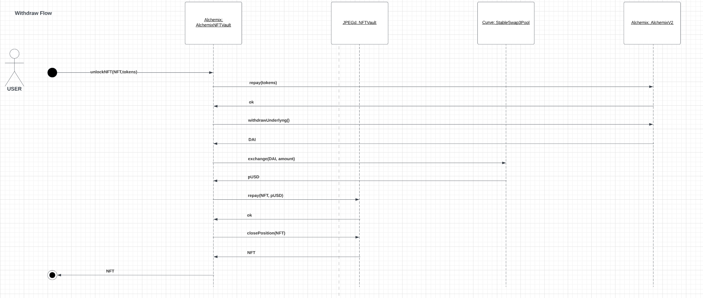

# Alchemix: Non-Fungible Tokens as Collateral
## Context

Currently, The Alchemix Platform allows users to leverage a range of ERC-20 tokens without risk of liquidation depositing those tokens in vaults.
## Proposal

Add the possibility to the users to deposit their NFTs as Collateral and take advantage of the Alchemix Protocol.
## Solution

Using the JPEGd NFT borrowing and lending platform, The Protocol will create a new vault asking the user to transfer its NFT. Nowadays, this platform has five different types of NFT collections. Such as CryptoPunks, BAYC, MAYC, Doodles and EtherRocks. Firstly, the idea is to create different types of vaults on Alchemix to allow users to deposit their tokens there. Secondly, behind the scene those tokens will be deposited into JPEGd in exchange of pUSD which will be minted. Thirdly, The pUSD tokens will be swapped in Curve Finance in exchange of DAI or any stablecoin that Alchemix supports. Finally, The DAI will follow the usual lending and borrowing details of Alchemix. 

### Deposit Flow

For instance, the following diagram shows a deposits flow where the user gets DAI tokens

### Withdraw Flow

## References

- [Alchemix](https://alchemix-finance.gitbook.io/v2/)
- [Curve](https://resources.curve.fi/base-features/understanding-crypto-pools)
- [JPEG’d](https://docs.jpegd.io/)